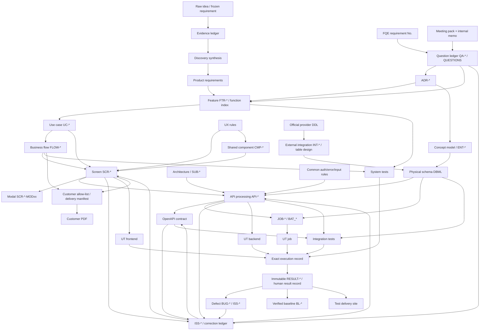

# AI-SDLC template and artifact audit

Date: 2026-08-09  
Scope: read-only comparison of `NTQ-NTD/AI-SDLC`, `NTQ-NTD/fqe-docs`, and the current `AI-SaaS-SDLC` project template.

## Executive finding

`AI-SaaS-SDLC` already has a stronger machine graph than `fqe-docs`: permanent frontmatter IDs, typed `depends_on` / `decisions` / `writes_to` / `implementation` edges, immutable execution-backed `RESULT-*`, baselines, impact closure, and 23 horizontally scalable templates. What it lacks is the content depth and operational evidence pattern proven in `fqe-docs`: detailed screen/API/batch/table specifications, a customer-confirmation and meeting layer, correction/review ledgers, one-to-one human-readable test results with evidence and defects, concrete examples, and delivery packaging.

`NTQ-NTD/AI-SDLC` already abstracts the FQE implementation into nine logical artifact classes and an eight-stage lifecycle. It should be treated as the conceptual source for expanding template contracts, while `fqe-docs` supplies the concrete section-level evidence.

## 1. Reusable model already extracted in `NTQ-NTD/AI-SDLC`

Evidence: `06_vong-doi-tung-loai-tai-lieu.md` §§1–5, `07_giai-phau-folder-va-tai-lieu.md` §10, `09_do-thi-tham-chieu.md` §§3–9.

| Logical family | Question answered | Lifecycle | FQE implementation |
|---|---|---|---|
| Frozen requirement record | What did the customer/source originally say? | Frozen | `要件定義/` |
| Question ledger | What is unresolved, who answered, where reflected? | Living ledger; rows retained | `外部設計書/QA一覧.md` |
| Decision record | Why was one viable option chosen? | Append-only; superseded records retained | `ADR/*.md` |
| External commitment | What was presented/agreed externally? | Closed per meeting/delivery | `打ち合わせ資料/`, PDF manifests |
| Behavioral specification | How must the system behave? | Living under review | UC, business flow, SCR/CMP/MOD, conceptual data, external batch |
| Implementation specification | How is behavior implemented? | Living against code | API, OpenAPI, physical schema, internal batch/common design |
| Verification specification/evidence | How is correctness proved? | Accumulative | UT/IT/ST specs, results, evidence, defects |
| Reconciliation ledger | Where do spec, interface, code, and tests differ? | Living ledger | `メモ/修正依頼/`, review records |
| Reference material | What does a term/rule/format mean? | Living, slow-changing | glossary, role matrix, common rules, templates |

All nine share the lifecycle: trigger → inputs → author → fixed structure → gate → downstream consumers → completion condition → retirement/supersession. Current `AI-SaaS-SDLC` frontmatter covers identity and graph edges well, but most templates do not state these eight lifecycle clauses in their body or embedded contract.

## 2. Current `AI-SaaS-SDLC` template catalog

All scalable templates use frontmatter with permanent `id`, `artifact_type`, `title`, lifecycle `status`, `created_by_change`, `depends_on`, `decisions`, and `supersedes`. Design/test artifacts additionally use `implementation`; write-producing designs use `writes_to`. Horizontal scale is one file per artifact, normally `{AREA}-{NNN}`, created through Genesis/Evolution/Reconciliation and validated by the deterministic engine.

### Discovery templates

| Template | Exact body sections | Dependency/scaling role |
|---|---|---|
| `ideal-customer-profile.template.md` (`ICP-*`) | Defining attributes; Trigger situation; Current workflow and alternative; Problem intensity and consequence; Buyer/budget/adoption; Exclusions; Supporting/contradicting evidence | Depends on customer/problem + evidence ledger; one per selected segment |
| `persona.template.md` (`PERSONA-*`) | Role in workflow; Goals/responsibilities; Decisions/permissions; Friction/failure consequences; Information/trust needs; Evidence basis/uncertainty | Depends on customer/problem + ICP; one per material role |
| `problem.template.md` (`PROBLEM-*`) | Situation/actor; Current job/workaround; Failure/frequency/consequence; Root cause vs symptom; Evidence/counter-evidence; Disproof conditions | Depends on customer/problem + evidence; one per problem area |
| `competitor.template.md` (`COMPETITOR-*`) | Category/target customer; Workflow/capabilities; Pricing/packaging; Strengths/boundaries; Complaints/gaps; Source dates/limits; Product implication | Depends on competitive/commercial + evidence; one per relevant competitor |

Representative singleton discovery artifacts are `original-idea.md`, `idea-definition.md`, `evidence-ledger.md`, `customer-and-problem.md`, `market-landscape.md`, `competitive-and-commercial.md`, `feasibility-and-risk.md`, and `opportunity-definition.md`. They are structurally complete skeletons but contain no populated exemplar.

### Product templates

| Template | Exact body sections | Dependency/scaling role |
|---|---|---|
| `feature.template.md` (`FTR-*`) | Problem/outcome; Actors/access; In scope; Out of scope; Observable behavior; States/failure; Data/shared interactions; Acceptance criteria; Compatibility/regression | Depends on product requirements + opportunity; primary horizontal product unit |
| `use-case.template.md` (`UC-*`) | Actors; Trigger; Preconditions; Main flow; Alternate flows; Error flows; Postconditions; Related product rules | Depends on one feature; one per actor-system goal/scenario |
| `business-flow.template.md` (`FLOW-*`) | Scope/participants; Entry/exit states; Flow; Business rules/invariants; Alternate/compensation paths; Cross-feature interactions | Depends on feature + UC; one per cross-feature/state journey |

Representative singleton product artifacts are `product-requirements.md`, `quality-requirements.md`, `access-control.md`, and `system-invariants.md`.

### Design templates

| Template | Exact body sections | Dependency/scaling role |
|---|---|---|
| `screen.template.md` (`SCR-*`) | 1 Overview; 2 Regions/layout; 3 Field/element table; 4 Actions/events table; 5 Validation/messages; 6 Transitions; 7 Accessibility/rationale | Depends on UC + UX + access control; one per routed screen |
| `shared-component.template.md` (`CMP-*`) | Purpose/reuse boundary; Inputs/outputs; Variants; States/interactions; Validation/errors; Accessibility; Consumer extension points | Depends on UX rules; one per reusable UI behavior |
| `subsystem.template.md` (`SUB-*`) | Purpose/boundary; Capability contracts; Inputs/outputs/stores; Quality budgets; Determinism/version pinning; Failure/degradation; Evaluation/acceptance; Security/data exposure | Depends on architecture + quality; one per non-trivial engine/subsystem |
| `api-processing.template.md` (`API-*`) | Callers/trigger; Authorization/tenant; Input validation; Processing sequence; Transaction/consistency; Side effects/events; Idempotency/concurrency; Errors/recovery; OpenAPI mapping | Depends on architecture; one per operation/process |
| `background-job.template.md` (`JOB-*`) | Trigger/schedule; Input selection; Processing/state transitions; Concurrency/idempotency; Retry/terminal failure; Cancellation/recovery; Outputs/events; Verification points | Depends on architecture; one per asynchronous job |
| `domain-entity.template.md` (`ENT-*`) | Meaning/ownership; Identity/tenant; Attribute table; Lifecycle/states; Invariants; Retention/deletion/export; Physical schema mapping | Depends on architecture + invariants; one per domain entity |
| `event.template.md` (`EVT-*`) | Meaning/producer; Trigger/transaction; Schema/versioning; Ordering/duplication; Consumers; Failure/replay; Sensitive-data classification | Depends on architecture; one per event contract |
| `external-integration.template.md` (`INT-*`) | Provider/purpose; Authentication/secrets; Contract/data; Rate/cost/quota; Timeout/retry/idempotency; Webhooks; Degradation/recovery; Sandbox/verification | Depends on architecture + quality; one per provider |

Fixed canonical contracts are `architecture-overview.md`, `ux-rules.md`, `error-catalog.md`, `interfaces/openapi.yaml`, `data/schema.dbml`, and `screen-transitions.mmd`. They receive stable graph identities and hashes, but the starter contains only skeleton contracts.

### Verification templates

| Template | Exact body sections | Dependency/scaling role |
|---|---|---|
| `unit-test-backend.template.md` (`UT-API-*`) | Unit boundary; Controlled collaborators; Case table (preconditions/input/output-or-error/state-or-interaction); special viewpoints; IT/ST handoff | Depends on API |
| `unit-test-frontend.template.md` (`UT-UI-*`) | Render/interaction boundary; Controlled collaborators; Case table (state/props/action/rendering/emitted action); IT/ST handoff | Depends on screen |
| `unit-test-job.template.md` (`UT-JOB-*`) | Job unit boundary; Controlled time/queues/collaborators; Case table (initial state/trigger/writes-events/retry-terminal); IT/ST handoff | Depends on job |
| `integration-test.template.md` (`IT-*`) | Boundary; Environment/dependencies; Setup/cleanup; Case table; Failure/recovery/degradation; Execution evidence | Depends on target artifact |
| `system-test.template.md` (`ST-*`) | Product behavior; Actors/environment; Preconditions/data; Journey table; Acceptance/invariants; Cross-feature regression; Quality viewpoints; Execution evidence | Depends on feature or flow |
| `test-result.template.md` (`RESULT-EXEC-*`) | Engine-owned provenance only | Generated from exact `EXEC` record; never copied or edited |

`test-policy.md` is the singleton source for UT/IT/ST boundaries and viewpoints.

### Control templates

| Template | Exact body sections | Dependency/scaling role |
|---|---|---|
| `architectural-decision.template.md` (`ADR-*`) | Context/trigger; Drivers; Options table; Decision; Consequences; Verification obligations; Affected scope; Supersession | Depends on triggering artifact; one per durable alternative choice; immutable after acceptance |
| `issue.template.md` (`ISS-*`) | Concrete observation; Expected vs observed; Authority determination; Affected closure; Resolution; Verification/regression evidence; Closure | Depends on affected artifact; one per concrete mismatch |

`questions.md` is the singleton question ledger with ID, question, source, status, answer/decision, and reflected-in columns.

## 3. Concrete FQE patterns and representative instances

### Requirements and product behavior

| Pattern | Representative instance | Exact information supplied | Dependencies and horizontal scale |
|---|---|---|---|
| Frozen requirement chapter | `要件定義/01_機能一覧.md`; `02_アプリケーション登録/01_データ・関連.md`; `03_分析/01_画面・操作.md` | Function No. 1–23, category, name, screen/report/batch class, summary, priority/scope; original entity sketches, cardinalities, fields/types, enumerations, screen requirements, numbered operation sequences, source ambiguities | Source slides → requirement record → UC/QA/ADR/external design. New domain chapters scale by directory; old text remains historical even when current design changes |
| Question ledger | `外部設計書/QA一覧.md` | `QA-NNN`, old ID, category, issue, provisional/final answer, customer-confirmation disposition, status, related UC/screen/ADR, source links; explicit allocation history | Statuses: 起票, 仮置き, 回答済み, 反映済み, ADR昇格, 廃止. IDs never reused; rows never deleted; answer must name reflection target |
| Feature index | `外部設計書/機能一覧.md` | `C/A/U/B-NN`, domain, behavior, actors, UC, QA, scope treatment; explicit next-step exclusions | Requirement/QA/ADR → feature → UC/screen/batch. Current treatment is one of 今回対応/確認中/次ステップ |
| UC | `外部設計書/1_ユースケース/ユースケース記述.md`, e.g. `UC-U02` | ID/name, actors, preconditions, trigger, postconditions, numbered basic flow, labeled alternatives | 22 UCs, including retained deprecated U10/U11. Requirement No. + role/QA → UC → business flow/SCR/external batch/tests |
| Business flow | four role flows in `2_業務フロー図/業務フロー図.md` | Cross-UC start, decisions, end, actor/system responsibility, linkage between admin and analysis work | Draw.io is canonical; SVG derived. Scales by actor/business path, not by screen |

### SCR/CMP/MOD behavioral specifications

Representative files: `SCR-U03_分析結果.md`, `CMP-04_凡例セット登録編集フォーム.md`, `SCR-U03-MOD01_凡例管理モーダル.md`.

Exact seven-section screen pattern:

1. Overview table: screen ID, target UC, user/permission, URL/menu, purpose, preconditions, related screens, notes.
2. Region table: region name and `A1…` ID, description, modal/placement notes.
3. Field/element table: label, local ID (`I/O/B/L-*`), region, UI widget, input/display/action class, required, visibility/editability, format, candidate/default/source, notes; complex tables have `3-x` column sub-tables.
4. Action/event table: trigger, `E-*`, user action, preconditions/input checks, processing, success, failure.
5. Validation/message table: target, `V-*`, condition, exact customer-facing text, notes.
6. Transition table: trigger, `T-*`, destination, condition/data handoff.
7. Rationale/special behavior.

`CMP-*` uses a component overview with reuse scope/placement and closes internal IDs inside the component. `SCR-*-MODxx` uses the same pattern but an ID namespace independent of its parent; parent owns the open trigger and modal owns internal interactions. Current inventory: 9 routed screens, 5 extracted modals, 4 shared components. The transition source is embedded in `画面遷移図.md`; generated SVG is non-canonical.

### Decision, data, API and batch implementation specifications

| Pattern | Representative instance | Exact information supplied | Dependencies and scale |
|---|---|---|---|
| ADR | `ADR/0010_分析バッチの処理対象を起動元APIが作成する待機行で確定する.md` | Status, context, exact question, decision, reasons/trade-offs, compared options with benefits/costs, impact, related QA/requirements/design/ADR | `NNNN_summary.md`; proposed/accepted/retired/superseded; 12 records, including supersession pairs 0001→0003 and 0006→0007 |
| Conceptual data | `5_データ関連図/データ関連図.md` | Entity meaning, key attributes, related entities, cardinality table, ownership/behavior rules, bridge to physical design | UC/QA/ADR → concept model → DBML/entity supplement/API/test |
| Physical schema | `物理ER図.dbml`, `t_analysis.md`, DDL/DML | DBML canonical type/null/constraint/index/FK/name; per-table business rules and screen/API links; 16 FAV DDL, 18 official external DDL, 19 ordered fixed/dev DML; physical delete, audit columns, optimistic locking, S3 key convention | DBML → generated SVG/DDL alignment; official DP/auth DDL remains external truth; individual supplements scale per `m_/r_/t_/s3_` object |
| External integration data | `外部連携テーブル.md` | Ownership, copied/read-only strategy, source table/column/type/null/key, FAV use, synchronization method/freshness, fallback, no-business-update rules | External official DDL + ADR → integration table design → API SQL and tests |
| API catalog | `内部設計書/01_API一覧.md` | API ID/name, method/path, calling `SCR/E`, roles, OpenAPI file, design status, notes | Central allocation/index; statuses 未着手/設計中/レビュー中/確定/廃止 |
| API design | `api/API-U03-07_分析実行.md` | §1 metadata and reverse screen/event/OpenAPI mapping; §2 shared rules; §3 endpoint/auth/roles/content type, request fields and example, message codes, validation, success schema/example, error contract; §4 ordered Controller/Service/DAO flow, SQL calls/binds, sequence diagram, table CRUD, actual SQL, transaction boundary; §5 reverse mapping to external `E/V` IDs | Screen + role + common design + DBML + ADR/QA + OpenAPI → API → UT/IT. 42 instantiated files |
| OpenAPI | ten `openapi/*.yaml` plus ten read-only Swagger pages | Current method/path/operation/schema/error/role interface | YAML is guarded until frontend agreement. Proposed differences live in correction ledgers, so API design may intentionally lead the contract |
| Common internal design | `共通事項.md`, `共通入力・凡例検証.md`, `共通エラー・例外ハンドリング設計.md` | Envelope, dates, paging/naming/layers, input normalization, exception→HTTP/message mapping, auth layers, request IDs, notification, shared sequencing | Canonical cross-cutting source referenced by every API rather than copied |
| External batch | `外部設計書/6_バッチ/分析バッチ.md` | Requirement mapping, full/incremental/delete patterns, related UC, trigger, inputs, main behavior, outputs/status, failure behavior, initiation matrix | Customer-visible asynchronous behavior; internal names excluded |
| Internal batch | `batch/BAT_01_特徴量抽出.md` | Metadata/trigger; shared rules; execution form, inputs, outputs, messages, validation, full status-transition table; ordered flow; per-step SQL/binds/errors; sequence; CRUD/SQL; transaction boundary; external mapping | API-created waiting rows → BAT_01–06 → DB/status/error → UI/results/tests |

### Verification, result, defect and operational records

| Pattern | Representative instance | Exact information supplied | Dependencies and scale |
|---|---|---|---|
| Backend UT | `単体テスト_API-U03-07_分析実行.md` | Document ID/version/history; target/out-of-scope and handoff; trace table to internal/OpenAPI/common docs; SQL seed reference; test viewpoint index; concrete preconditions, inputs, HTTP result, assertions; unresolved items | One spec per API; JUnit and seed SQL traceable. Current FQE has 41 backend UT specs |
| Frontend UT | `UT-FE-SCR-A01_アプリケーション一覧.md` | Target screen and URL, refs, screen-local mock/data policy, role, action, expected UI and API-call behavior, code mapping, explicit IT handoff table | One spec per parent screen including modal; Playwright; 5 instantiated specs |
| Batch UT | `単体テスト_BAT-01_特徴量抽出.md` | Job input/state, controlled stores/time/modules, numeric tolerances where relevant, writes/status/errors, code mapping | One spec + SQL seed per BAT; 6 instantiated specs |
| IT-Web / IT-Batch / ST | templates under `テスト/templates/` | Environment/account/data IDs, setup/reuse/reset, real boundary, case operations, UI/API/DB/job/log evidence, cleanup; batch state transition matrix; system journey and cross-feature checkpoints | FQE has templates but no instantiated IT/ST specs in the audited tree |
| Result/evidence | `RESULT-UT-BE-API-U03-07_分析実行.md` | `RESULT-{spec-ID}` ↔ target ID 1:1; environment/version/command; summary and verdict; append-only run history; pass/fail/skip; failed cases/methods; defect and `EV-*`; internal evidence table; cleanup confirmation | Spec + real execution → result. 27 instantiated result docs |
| Defect ledger | `テスト/テスト結果/単体テスト/障害表.md` | `BUG-UT-NNN`, date/reporter, spec/case, code location, phenomenon, actual vs expected, cause classification/detail, fix/commit, severity/priority, status, fixer/date, retest/verifier/date, notes | Failure → defect → fix → rerun/result. Statuses 未対応/調査中/修正中/再テスト待ち/完了/却下/保留 |
| Meeting pack | `打ち合わせ資料/2026-06-30/特徴量設計_仕様まとめ.md` | Date/participants, agenda, questions to decide, referenced designs, proposals, QA IDs, decision checklist, unresolved items, next meeting | One dated customer Markdown → checked final PDF; immutable historical snapshot |
| Internal meeting memo | `internal-memo.md` | Preparation purpose, live result, QA update proposal, design reflection proposal, priorities, carryover, raw notes | Meeting → memo → QA/design update plan; never customer delivery |
| Reconciliation ledger | `メモ/修正依頼/修正依頼_yaml_U03.md`, front/backend/test ledgers + index | Ticket ID, status, task, affected screen/files, acceptance condition, dated append-only findings, implementation/YAML distinction; index status synchronized | Design/code/interface audit → correction ticket → approved target edit → test/review. 11 ledgers + index |
| Review record | `メモ/レビュー記録/2026-08-03_UT-FE-SCR-A01_アプリケーション一覧.md` | Review scope, explicit review assumptions, actionable `R-*`, evidence, correction direction, status, re-review workflow | Reviewer records findings; author edits spec; record state changes until closure |

### Delivery outputs

- Customer design PDF: allow-listed `pdf-manifest/*.txt` orders Markdown; strict customer-content check removes internal blocks; draw.io/Mermaid/SVG rendered; output under ignored `dist/pdf/`.
- Meeting PDF: exactly one customer Markdown per date directory produces the same-basename PDF; internal memo excluded.
- Test delivery site: generator joins spec then matching result by IDs, strips `fqe-internal` evidence and repository-only links, writes ignored delivery Markdown and MkDocs site. Generated files are never edited.
- Local engineering docs: MkDocs index exposes overall, API, batch, DB, and screen definitions; Swagger view disables Try it out.

## 4. Mermaid-ready dependency graph

Primary stable joins are: requirement No. → `QA-*` / `ADR-*` → `FTR-*` / `UC-*` → `SCR-*` + local `E/V/T` → `API-*` → `JOB/BAT-*` + table/column → `UT/IT/ST-*` → execution → `RESULT-*` → `BUG/ISS-*` → successor baseline. Downstream declares edges; generated reverse indexes remain projections.

## 5. Content depth missing from current `AI-SaaS-SDLC`

### Highest-impact gaps

1. **No populated exemplar pack.** All 23 scalable templates and most singleton files are skeletons. FQE demonstrates why examples matter: ID usage, table granularity, error wording, transaction detail, test handoff, and ledger closure cannot be inferred reliably from headings alone.
2. **No frozen requirement/customer-answer artifact.** `IDEA-ORIGINAL` preserves the founder idea, but there is no pattern equivalent to received requirement chapters with numbered source statements, ambiguities, and retained historical contradictions.
3. **No external commitment/meeting/delivery layer.** There is no dated meeting pack, internal memo, customer-safe allow-list, PDF/site packaging manifest, or strict internal-content exclusion workflow. This is an intentional current product boundary, but it leaves one of the nine mature-document families unrepresented.
4. **Screen depth is too shallow.** The current `SCR` table lacks FQE's region IDs, input/display/action classification, required/visibility/editability distinctions, format rules, candidate/default/source, column sub-tables, exact success/failure behavior, explicit message text and transition data handoff. There is no separate `MOD-*` pattern or parent/modal namespace contract.
5. **API depth is too shallow for direct implementation.** Current headings are good but omit standard request/response field tables and examples, API-local message catalog, HTTP error matrix linked to screen validation IDs, named SQL/bind mappings, CRUD/table matrix, actual query or repository contract, layer responsibility, sequence diagram, and reverse `SCR/E/V` mapping table.
6. **Job depth is too shallow.** Missing explicit input/output tables, message codes, status values and transition matrix, per-step error persistence, per-step SQL/data mappings, parent/child status ownership, and transaction boundaries.
7. **Physical data operations are absent.** DBML and `ENT-*` cover model identity, but there are no per-table supplements, ordered DDL, fixed-master DML, dev/test seed policy, official external DDL preservation, synchronization/freshness/fallback rules, or generated-schema workflow.
8. **Test specifications are under-specified.** Current case tables omit document version/history, explicit target/out-of-scope/handoff matrix, reference-to-heading trace table, data IDs and reset/reuse, execution prerequisites, code class/method mapping, case summary, unresolved questions, and level-specific evidence objects.
9. **Result evidence is command-centric only.** Engine provenance is excellent, but there is no customer/human result record with per-case run history, aggregate verdict/reason, defect links, evidence IDs, cleanup confirmation, or controlled separation of internal evidence from delivery output.
10. **No defect taxonomy/ledger.** `ISS-*` captures one mismatch well, but no test-level consolidated view supplies severity, priority, state counts, code location, actual/expected, cause class, fix commit, and retest closure.
11. **Reconciliation lacks domain ledgers and dated append-only audit.** `ISS-*` is generic and one-file-per-issue; FQE ledgers are efficient for many related interface/frontend/backend/test mismatches and explicitly distinguish implemented behavior from guarded OpenAPI changes.
12. **No review-record pattern.** There is no artifact for reviewer-only findings, evidence, author-owned corrections, per-finding state, and re-review closure.
13. **Lifecycle/completion clauses are documented globally, not embedded per template.** `docs/artifact-reference.md` says template contracts should include purpose, allowed content, ID, upstream, downstream, lifecycle and completion; most template bodies currently provide only a short HTML comment and headings, not the full eight-stage contract described by `AI-SDLC`.

### Important differences that are strengths, not gaps

- Current `depends_on`, `decisions`, `writes_to`, `implementation`, baselines, unioned old/new graph edges, permanent IDs, and structural validation are materially stronger than FQE's largely manual links.
- `RESULT-EXEC-*` provenance prevents fabricated evidence better than FQE's manually maintained result pages.
- Discovery (`ICP`, persona, problem, competitor, evidence reassessment) is far richer than FQE and should remain.
- `FTR-*`, `SUB-*`, `EVT-*`, and explicit quality/invariant artifacts add useful layers absent from the FQE taxonomy.

## 6. Concrete inconsistencies in the FQE specimen to avoid copying

- API catalog has `API-U01-05` for batch-error detail, while the actual design/test files use `API-M04-01`; `API-AUTH-03` exists but is absent from the catalog. Preserve current engine-enforced identity and reference integrity.
- External batch README declares `失敗区分一覧.md`, but the file is absent.
- OpenAPI intentionally lags approved design changes; correction ledgers are necessary, but current `AI-SaaS-SDLC` should make this an explicit contract state rather than a filename convention.
- FQE has namespace collisions (`B-xx` means button, backend correction, or batch function). Keep global prefixes disjoint from local IDs.
- UC↔screen is declared on both sides without a checker. Retain the current one-way downstream-declares-edge model.
- Current FQE test delivery cannot fully build from the audited tree: 37 specs declare a result ID, only 27 results exist, leaving 10 missing (`COM-01..06`, `U04-01..04`); another 15 unit specs lack result IDs and are excluded. Current engine hard-failure behavior is preferable.

## 7. Suggested template expansion order

1. Add full embedded template contracts and one populated exemplar each for FTR, UC, FLOW, SCR, CMP, API, JOB, ENT, UT, IT, ST, ADR and ISS.
2. Deepen SCR/API/JOB/ENT/test sections using the FQE fields above without weakening frontmatter graph ownership.
3. Add `MOD-*`, review record, consolidated defect ledger, and optional grouped reconciliation ledger.
4. Add a human-readable result projection generated from immutable execution records, with run history, case/defect/evidence links and cleanup state.
5. Add optional external-commitment packaging (meeting record + allow-listed delivery manifest) only if customer-facing documentation enters product scope.
6. Add schema generation/verification patterns for DBML → DDL/diagram and OpenAPI → safe viewer/client checks.

## Unresolved questions

- Should customer-facing meeting/delivery artifacts remain explicitly out of scope, or become an optional profile?
- Should grouped reconciliation/defect ledgers be canonical artifacts or generated projections over `ISS-*`?
- Should SQL/query detail live in `API-*`, a separate repository mapping artifact, or only in inspected implementation links?
